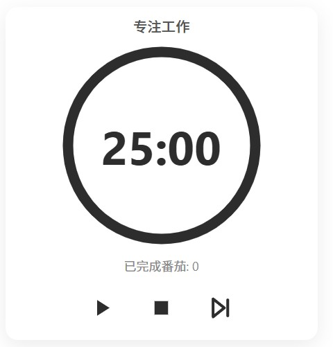
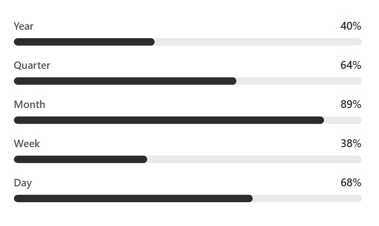
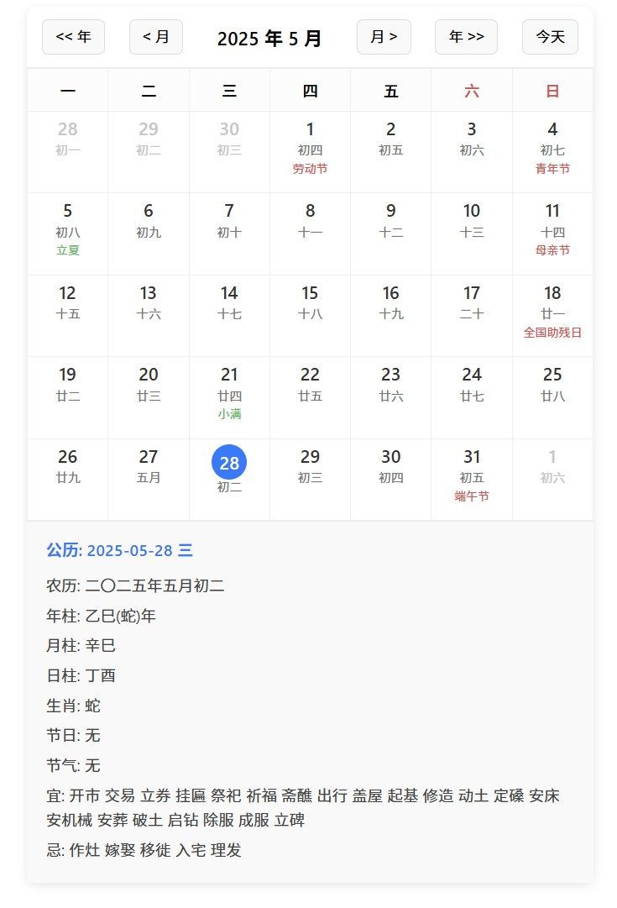

# Notion 效率小组件 (my-notion-widget)

欢迎来到我的 Notion 效率小组件仓库！这里收集了一系列我制作的免费开源 Notion Widget，希望能帮助大家提升 Notion 使用体验和效率。

---

## ✨ 目前包含的小组件

以下是当前可用的小组件列表：

1.  **🍅 番茄钟 (Pomodoro Timer)**
    *   **简介:** 一个简约美观的番茄工作法时钟，帮助您专注工作和学习。
    *   **预览:** 
        
    *   **使用方法:**
        1.  在 Notion 中，输入 `/embed` 然后按回车。
        2.  在弹出的窗口中，粘贴以下链接：
            ```
            https://jason-effi-lab.github.io/my-notion-widget/tomato-clock  
            ```

2.  **⏳ 时间进度条 (Time Progress Bar)**
    *   **简介:** 可视化显示年/季/月/周/日的进度。
    *   **预览:** 
        
    *   **使用方法:**
        1.  在 Notion 中，输入 `/embed` 然后按回车。
        2.  粘贴相应的链接：
            ```
            https://jason-effi-lab.github.io/my-notion-widget/life-progress/
            ```

3.  **📅 万年历 (Perpetual Calendar)**
    *   **简介:** 一个简洁的万年历，方便查阅日期。
    *   **预览:** 
        
    *   **使用方法:**
        1.  在 Notion 中，输入 `/embed` 然后按回车。
        2.  粘贴以下链接：
            ```
            https://jason-effi-lab.github.io/my-notion-widget/lunar-calendar/
            ```

4.  **🔮 星座运势 (Horoscope)**
    *   **简介:** 根据生日查看每日星座运势。
    *   **预览:** 
        
    *   **使用方法:**
        1.  在 Notion 中，输入 `/embed` 然后按回车。
        2.  粘贴以下链接，并将 `MMDD` 替换为您的出生月份和日期 (例如 `0911` 代表9月11日):
            ```
            https://jason-effi-lab.github.io/my-notion-widget/horoscope/?birthday=0911
            ```

---


## 💡 反馈与贡献

*   如果您在使用过程中遇到任何问题，或者有任何建议，欢迎告诉我
*   如果您有新的 Widget 想法或者想改进现有 Widget，也欢迎告诉我
*   联系方式：公众号: 杰森的效率工坊
*   也欢迎关注我的抖音，小红书，B站或者视频号，ID都是: 杰森的效率工坊

---

<p align="center">
  Enjoy your more efficient Notion! ✨
</p>